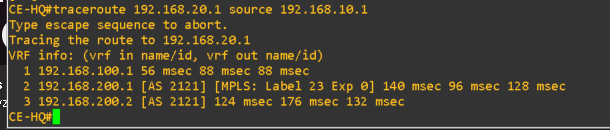

# Advanced Networking Topology Lab

Advanced GNS3 networking lab that models an IPv4/IPv6 service-provider core and a customer MPLS L3VPN. The topology combines multi-area OSPF, iBGP/eBGP, a route reflector, MPLS/LDP, VPNv4, a VRF, and QoS.

<div align="center">


</div>

> **Lab status:** the repository includes corrected startup configurations and static validation artifacts. Start the topology in GNS3 and run the verification commands below to confirm live adjacencies and end-to-end forwarding in your environment.

## Topology


The GNS3 project contains **10 nodes** and **9 links**:

```text
PC1 — CE-HQ — R1 — R2 — CE-BR — PC2
                 |     |
                 R3 — R4
                 |     |
             ASBR-2122 ASBR-2123
```

| Device | Role |
|---|---|
| `R1`, `R2`, `R3`, `R4` | Provider routers in **AS 2121**. `R1` and `R2` are PEs; `R3` and `R4` are core/P routers and external BGP edge points. |
| `R3` | iBGP and VPNv4 route reflector for the provider routers. |
| `ASBR-2122` | External peer in **AS 2122**, connected to `R3`; this is the preferred external path. |
| `ASBR-2123` | External peer in **AS 2123**, connected to `R4`; this is the backup external path. |
| `CE-HQ`, `CE-BR` | Customer-edge routers for the headquarters and branch sites. |
| `PC1`, `PC2` | VPCS hosts on the HQ and branch LANs. |

## Routing and service design

### Provider underlay

The AS 2121 core uses OSPFv2 and OSPFv3 with this area design:

| Link or component | OSPF area | Purpose |
|---|---:|---|
| `R3` — `R4` | 0 | Backbone/core transit link. |
| `R1` — `R3` | 1 | Standard transit area. |
| `R1` — `R2` | 2 (stub) | Stub area serving `R2`. |
| `R1` ↔ `R3` virtual link | Through area 1 | Connects `R1` logically to the backbone because it has no physical area-0 interface. |

MPLS/LDP is enabled only on the provider-core links: `R1-R3`, `R1-R2`, and `R3-R4`. It is deliberately excluded from PE-CE and external AS links.

### BGP and path preference

- **iBGP:** provider loopbacks peer through `R3`, which acts as the route reflector.
- **VPNv4:** `R1` and `R2` exchange customer-VRF routes through `R3`; extended communities are sent for route-target handling.
- **eBGP:** `R3` peers with AS 2122 and `R4` peers with AS 2123 for IPv4 and IPv6.
- **Preferred exit:** routes received from AS 2122 are assigned local preference `200`, making the `R3 → ASBR-2122` path preferred over the default preference of `100`.
- **Backup inbound path:** advertisements sent toward AS 2123 are prepended with AS 2121 three times, making that path less attractive to external networks.

### Customer VPN

The customer service is carried in the `ENTERPRISE` VRF:

- `R1` ↔ `CE-HQ`: eBGP between AS 2121 and customer AS 65010.
- `R2` ↔ `CE-BR`: RIP version 2 inside the `ENTERPRISE` VRF.
- `R1` and `R2`: MP-iBGP VPNv4 via the `R3` route reflector.
- `R1`: QoS marks traffic entering from the HQ CE and applies a priority/fair-queue policy on the R1-to-R3 core link.

## Addressing plan

### Customer VPN IPv4 addressing

| Segment | Network | Assigned addresses |
|---|---|---|
| HQ LAN | `192.168.10.0/24` | `CE-HQ`: `192.168.10.1`, `PC1`: `192.168.10.10` |
| HQ PE-CE link | `192.168.100.0/30` | `R1`: `192.168.100.1`, `CE-HQ`: `192.168.100.2` |
| Branch PE-CE link | `192.168.200.0/30` | `R2`: `192.168.200.1`, `CE-BR`: `192.168.200.2` |
| Branch LAN | `192.168.20.0/24` | `CE-BR`: `192.168.20.1`, `PC2`: `192.168.20.10` |

### Provider and external addressing

| Link | IPv4 network | IPv6 network |
|---|---|---|
| `R1` — `R3` | `121.1.0.0/30` | `2123:4561:0:1::/64` |
| `R1` — `R2` | `121.1.0.4/30` | `2123:4561:0:2::/64` |
| `R3` — `R4` | `121.1.0.8/30` | `2123:4561:0:3::/64` |
| `R3` — `ASBR-2122` | `121.1.0.12/30` | `2123:4561:0:4::/64` |
| `R4` — `ASBR-2123` | `121.1.0.16/30` | `2123:4561:0:5::/64` |

Provider loopbacks use `121.0.0.1/32` through `121.0.0.4/32` and `2123:4561:0:F::1/128` through `::4/128`. The external AS loopbacks are `122.0.0.1/32` / `2123:4562:0:F::1/128` and `123.0.0.1/32` / `2123:4563:0:F::1/128`.

## Evidence

The `evidences/` folder contains screenshots recorded during lab work. They document individual reachability and routing observations; they should be interpreted together with fresh live validation after the topology is started.

### Core and customer-path evidence

#### CE-HQ to CE-BR traceroute



This capture shows a traceroute from `CE-HQ` to `CE-BR` using the provider path `R1 → R3 → R2`. It demonstrates CE-to-CE reachability at the time it was captured. It does **not** by itself prove `PC1` to `PC2` connectivity; use the VPCS checks below after startup.

#### R1 to R4 reachability


This capture records successful R1-to-R4 reachability across the provider core.

### External BGP and IPv6 evidence

#### R1 view of AS 2122


#### R1 IPv6 view of AS 2122


#### R1 view of AS 2123


These screenshots provide historical BGP/IPv6 observations for the external AS paths. Because BGP state and best paths are dynamic, confirm the current neighbor state and selected routes with the commands in the next section.

## Running the lab

1. Open [`project/project.gns3`](project/project.gns3) in GNS3.
2. Configure a Cisco 7200-compatible IOS image that supports OSPFv3, BGP with VPNv4, MPLS/LDP, VRF, and QoS. Cisco IOS images are not distributed in this repository.
3. Confirm that all router and VPCS nodes are started. The startup configurations are under `project/project-files/`; exported copies are in `configs/`.
4. Wait for OSPF, LDP, and BGP convergence before testing reachability.

## Verification checklist

Run the following commands on the relevant routers after startup:

```text
show ip ospf neighbor
show ip ospf virtual-links
show ipv6 ospf neighbor
show mpls ldp neighbor
show mpls forwarding-table
show ip bgp summary
show bgp ipv6 unicast summary
show bgp vpnv4 unicast all summary
show ip route vrf ENTERPRISE
show bgp vpnv4 unicast vrf ENTERPRISE
```

Expected outcomes:

- OSPF adjacencies are established on the core links, and the R1-R3 virtual link is up.
- LDP neighbors appear only on the three AS 2121 core links.
- IPv4 and IPv6 eBGP sessions are established with both external ASBRs.
- `R1` and `R2` have routes to the opposite customer LAN in VRF `ENTERPRISE`.
- AS 2122-learned routes are preferred while available.

On the VPCS endpoints, validate the complete customer path:

```text
# On PC1
show ip
ping 192.168.20.10
trace 192.168.20.10

# On PC2
show ip
ping 192.168.10.10
trace 192.168.10.10
```

## Repository layout

| Path | Contents |
|---|---|
| [`asset/`](asset/) | Topology diagram used in this README. |
| [`evidences/`](evidences/) | Historical screenshots of traceroute, ping, BGP, and IPv6 observations. |
| [`configs/`](configs/) | Exported Cisco IOS device configurations. |
| [`project/`](project/) | GNS3 project file, device startup configurations, VPCS startup files, and a detailed Portuguese implementation guide. |
| [`.gitignore`](.gitignore) | Excludes local tool settings, runtime files, and the portable archive containing an IOS image. |

## Notes on publishing

The ignored `advanced-network.gns3project` portable archive embeds a Cisco IOS image. Do not publish or redistribute it unless you have confirmed the relevant licensing rights. Local `.claude/` settings are also ignored to avoid committing environment-specific configuration or credentials.