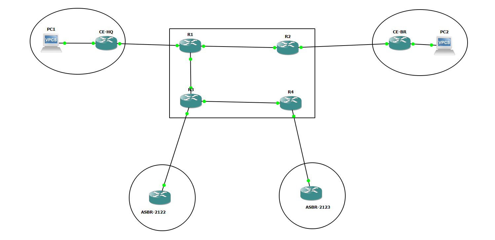

# TAR — Teste Prático de Recurso (06/02/2025) — Guia de implementação em GNS3

> Tópicos Avançados de Redes · Ano letivo 2024/2025
> Guia passo-a-passo para implementar o ENTERPRISE em GNS3: endereçamento, OSPFv2/OSPFv3 multi-área, eBGP/iBGP com Route-Reflector, MPLS L3VPN e QoS.



## Índice

1. [Como este guia interpreta o enunciado](#1-como-este-guia-interpreta-o-enunciado)
2. [Topologia proposta e papéis dos routers](#2-topologia-proposta-e-papéis-dos-routers)
3. [Preparar o projeto GNS3](#3-preparar-o-projeto-gns3)
4. [Plano de endereçamento (Parte 2)](#4-plano-de-endereçamento-parte-2)
5. [Parte 2 — Configuração base de cada router](#5-parte-2--configuração-base-de-cada-router)
6. [Parte 3 — OSPFv2 / OSPFv3 multi-área](#6-parte-3--ospfv2--ospfv3-multi-área)
7. [Parte 4 — eBGP, iBGP e Route-Reflector](#7-parte-4--ebgp-ibgp-e-route-reflector)
8. [Parte 5 — MPLS e VPN "ENTERPRISE"](#8-parte-5--mpls-e-vpn-enterprise)
9. [Parte 6 — QoS em R1](#9-parte-6--qos-em-r1)
10. [Verificação e traceroutes](#10-verificação-e-traceroutes)
11. [Empacotar a entrega](#11-empacotar-a-entrega)
12. [Publicar no GitHub](#12-publicar-no-github)

---

## 1. Como este guia interpreta o enunciado

A Figura 1 tem **8 routers** no total, desenhados explicitamente:

| # | Posição na figura | Nome neste guia |
|---|---|---|
| 1 | Dentro da elipse laranja esquerda (VPN-Site Sede), à direita do PC | `CE-HQ` |
| 2 | Borda esquerda da nuvem azul, rotulado "R1" | `R1` |
| 3 | Borda direita da nuvem azul, ligado à elipse laranja direita | `R2` |
| 4 | Dentro da elipse laranja direita (VPN-Site Filial), à esquerda do PC | `CE-BR` |
| 5 | Interior da nuvem azul, em baixo à esquerda, com fio para fora | `R3` |
| 6 | Interior da nuvem azul, em baixo à direita, com fio para fora | `R4` |
| 7 | Dentro da nuvem verde Tier 2A (AS#2122) | `ASBR-2122` |
| 8 | Dentro da nuvem verde Tier 2B (AS#2123) | `ASBR-2123` |

O que a figura **não** representa explicitamente são os cabos internos entre R1, R2, R3 e R4 — a nuvem azul "Tier 1 OSPFv3 Multi-Area" abstrai-os propositadamente, porque a Parte 2 pede que sejas tu a estruturar essa cablagem interna (área backbone + standard + stub + virtual-link).

Este guia propõe uma cablagem interna concreta que cumpre os 4 requisitos ao mesmo tempo, sem adicionar nenhum router que não esteja na figura. Se a tua correção preferir outra disposição, os princípios e a maior parte da configuração mantêm-se — muda apenas quem fica em que área.

**Nomenclatura usada neste guia:**

| Nome | Elemento na Figura 1 |
|---|---|
| `R1` | Router rotulado "R1", borda esquerda da nuvem, PE ligado ao CE-HQ |
| `R2` | Router borda direita da nuvem, PE ligado ao CE-BR |
| `R3` | Router interior inferior esquerdo da nuvem, ASBR ligado ao AS#2122 |
| `R4` | Router interior inferior direito da nuvem, ASBR ligado ao AS#2123 |
| `CE-HQ` / `CE-BR` | Routers CE dentro das elipses laranja |
| `ASBR-2122` / `ASBR-2123` | Routers dentro das nuvens verdes Tier 2A / Tier 2B |
| `PC1` / `PC2` | Computadores dentro das elipses laranja |

---

## 2. Topologia proposta e papéis dos routers

**Ligações internas do AS#2121** (os cabos entre R1/R2/R3/R4 que a nuvem azul não explicita):

| Ligação | Área OSPF | Observação |
|---|---|---|
| R3 — R4 | Área 0 (backbone) | Liga os dois routers "core" |
| R1 — R3 | Área 1 (standard/transit) | R3 é ABR entre a Área 0 e a Área 1 |
| R1 — R2 | Área 2 (stub) | R1 é ABR entre a Área 1 e a Área 2 |
| Virtual-link R1 ↔ R3 | via Área 1 (transit) | R1 não tem nenhuma interface física na Área 0, por isso precisa do virtual-link para ficar "ligado" ao backbone — sem ele, a Área 2 (stub) ficaria desconexa da Área 0 |

Esta é a razão de ser do virtual-link no enunciado: **não é um extra decorativo, é uma necessidade topológica** consequência de R1 só tocar nas Áreas 1 e 2.

**Papel de cada router:**

- **R1 e R2** — PE (Provider Edge) da MPLS L3VPN "ENTERPRISE"; ligam-se aos CE dos clientes (Sede e Filial).
- **R3 e R4** — routers P (core) do AS#2121 e, simultaneamente, ASBR: fazem eBGP com o AS#2122 e AS#2123 respetivamente.
- **R3** — além de ASBR, é também o **Route-Reflector** (iBGP e MP-iBGP VPNv4) para R1, R2 e R4.

**Lista de equipamento GNS3:**

| Nome | Papel |
|---|---|
| R1, R2, R3, R4 | Routers do AS#2121 |
| ASBR-2122 | Representa o AS#2122 / Tier 2A |
| ASBR-2123 | Representa o AS#2123 / Tier 2B |
| CE-HQ, CE-BR | Routers CE da VPN "ENTERPRISE" |
| PC1, PC2 | Hosts finais (podem ser VPCS do GNS3) |
| Switch opcional | Entre CE e PC, se quiseres mais do que 1 host por site |

---

## 3. Preparar o projeto GNS3

1. **Imagem de IOS**: o GNS3 não inclui IOS. Precisas de uma imagem Cisco que suporte OSPFv3, BGP (incluindo `address-family vpnv4`), MPLS/LDP e MQC (QoS) — tipicamente um `c7200` com IOS `adventerprisek9` ou um `IOSv` (feature set `ipbase`/`k9` conforme disponibilidade). Confirma no `show version` que tens `mpls ip`, `router bgp` com `address-family vpnv4` e `mpls ldp` disponíveis antes de começares.
2. Cria um novo projeto GNS3, por exemplo `TAR-Recurso-2025`.
3. Arrasta os 8 routers (R1, R2, R3, R4, CE-HQ, CE-BR, ASBR-2122, ASBR-2123) + 2 VPCS (PC1 e PC2) de acordo com a tabela acima e reproduz o cablado:
   - `R1 — R3`, `R1 — R2`, `R3 — R4` (interno ao AS#2121)
   - `R3 — ASBR-2122`, `R4 — ASBR-2123` (eBGP)
   - `R1 — CE-HQ`, `R2 — CE-BR` (PE-CE da VPN)
   - `CE-HQ — PC1`, `CE-BR — PC2`
4. Liga cada porta a uma interface diferente (ex: `Gi0/0`, `Gi0/1`, `Gi0/2`) — adapta os nomes de interface ao teu modelo de router (`FastEthernet`, `GigabitEthernet` ou `Serial`, conforme a plataforma).

---

## 4. Plano de endereçamento (Parte 2)

### 4.1 Substituição do número de aluno (IPv6)

O enunciado usa `2XXX:XXX1::/32` — os 6 carateres `X` correspondem aos 6 dígitos do teu número de aluno, divididos 3+3. Se o teu número for `123456`:

```
2XXX:XXX1::/32  →  2123:4561::/32   (AS#2121)
2XXX:XXX2::/48  →  2123:4562::/48   (AS#2122)
2XXX:XXX3::/48  →  2123:4563::/48   (AS#2123)
```

Neste guia uso o exemplo `123456`. **Substitui pelos teus 6 dígitos reais em todo o documento** (um `find & replace` de `2123:456` por `2[teus 3 primeiros]:[teus 3 últimos]` resolve tudo de uma vez).

### 4.2 IPv4 — AS#2121 (121.0.0.0/16)

| Bloco | Uso |
|---|---|
| `121.0.0.0/29` | Loopbacks (Router-ID / BGP) |
| `121.1.0.0/30` | R1 — R3 (Área 1) |
| `121.1.0.4/30` | R1 — R2 (Área 2, stub) |
| `121.1.0.8/30` | R3 — R4 (Área 0) |
| `121.1.0.12/30` | R3 — ASBR-2122 (eBGP) |
| `121.1.0.16/30` | R4 — ASBR-2123 (eBGP) |

| Router | Loopback0 (Router-ID) |
|---|---|
| R1 | 121.0.0.1/32 |
| R2 | 121.0.0.2/32 |
| R3 | 121.0.0.3/32 |
| R4 | 121.0.0.4/32 |

| Interface | Endereço |
|---|---|
| R1 → R3 | 121.1.0.1/30 |
| R3 → R1 | 121.1.0.2/30 |
| R1 → R2 | 121.1.0.5/30 |
| R2 → R1 | 121.1.0.6/30 |
| R3 → R4 | 121.1.0.9/30 |
| R4 → R3 | 121.1.0.10/30 |
| R3 → ASBR-2122 | 121.1.0.13/30 |
| ASBR-2122 → R3 | 121.1.0.14/30 |
| R4 → ASBR-2123 | 121.1.0.17/30 |
| ASBR-2123 → R4 | 121.1.0.18/30 |

### 4.3 IPv4 — AS#2122 e AS#2123

| AS | Loopback ASBR | LAN interna (simula o Tier 2) |
|---|---|---|
| AS#2122 (122.0.0.0/16) | 122.0.0.1/32 | 122.1.0.0/24 |
| AS#2123 (123.0.0.0/16) | 123.0.0.1/32 | 123.1.0.0/24 |

### 4.4 IPv4 — VPN "ENTERPRISE" (endereçamento privado, conforme Parte 5-1)

| Ligação | Endereço |
|---|---|
| R1 (VRF) — CE-HQ | 192.168.100.1/30 — 192.168.100.2/30 |
| R2 (VRF) — CE-BR | 192.168.200.1/30 — 192.168.200.2/30 |
| LAN Sede (CE-HQ — PC1) | 192.168.10.0/24 |
| LAN Filial (CE-BR — PC2) | 192.168.20.0/24 |

### 4.5 IPv6 — AS#2121 (2123:4561::/32, exemplo)

| Interface | Endereço |
|---|---|
| Loopbacks | 2123:4561:0:F::1/128 (R1), `::2` (R2), `::3` (R3), `::4` (R4) |
| R1 — R3 (Área 1) | 2123:4561:0:1::1/64 — `::2`/64 |
| R1 — R2 (Área 2) | 2123:4561:0:2::1/64 — `::2`/64 |
| R3 — R4 (Área 0) | 2123:4561:0:3::1/64 — `::2`/64 |
| R3 — ASBR-2122 | 2123:4561:0:4::1/64 — `::2`/64 |
| R4 — ASBR-2123 | 2123:4561:0:5::1/64 — `::2`/64 |

### 4.6 IPv6 — AS#2122 e AS#2123

| AS | Loopback | LAN |
|---|---|---|
| AS#2122 (2123:4562::/48) | 2123:4562:0:F::1/128 | 2123:4562:0:1::/64 |
| AS#2123 (2123:4563::/48) | 2123:4563:0:F::1/128 | 2123:4563:0:1::/64 |

> A VPN "ENTERPRISE" é só IPv4 (o enunciado só exige endereçamento privado IPv4 para a rede empresarial), por isso não há bloco IPv6 para a Sede/Filial.

### 4.7 Link-local (requisito 5)

No IOS, basta ativares IPv6 na interface (`ipv6 enable` ou atribuir um endereço global) que o link-local `fe80::/10` é gerado automaticamente por EUI-64. Confirma com `show ipv6 interface brief` — se quiseres um link-local determinístico, define-o explicitamente:

```
interface GigabitEthernet0/0
 ipv6 address FE80::1 link-local
```

---

## 5. Parte 2 — Configuração base de cada router

Config representativa de **R1** (repete o padrão para os restantes, ajustando IPs/nomes de interface):

```
hostname R1
!
ipv6 unicast-routing
!
interface Loopback0
 ip address 121.0.0.1 255.255.255.255
 ipv6 address 2123:4561:0:F::1/128
!
interface GigabitEthernet0/0
 description Link para R3 (Area 1)
 ip address 121.1.0.1 255.255.255.252
 ipv6 address 2123:4561:0:1::1/64
 ipv6 enable
 mpls ip
 no shutdown
!
interface GigabitEthernet0/1
 description Link para R2 (Area 2 - stub)
 ip address 121.1.0.5 255.255.255.252
 ipv6 address 2123:4561:0:2::1/64
 ipv6 enable
 mpls ip
 no shutdown
!
interface GigabitEthernet0/2
 description Link PE-CE para CE-HQ (VRF ENTERPRISE)
 vrf forwarding ENTERPRISE
 ip address 192.168.100.1 255.255.255.252
 no shutdown
```

**Tabela-resumo dos restantes routers do AS#2121** (mesma lógica, hostname + loopback + interfaces conforme a secção 4):

| Router | Loopback0 | Interfaces físicas |
|---|---|---|
| R2 | 121.0.0.2/32 · 2123:4561:0:F::2/128 | Gi0/0→R1 (Área 2), Gi0/1→CE-BR (VRF ENTERPRISE) |
| R3 | 121.0.0.3/32 · 2123:4561:0:F::3/128 | Gi0/0→R1 (Área 1), Gi0/1→R4 (Área 0), Gi0/2→ASBR-2122 |
| R4 | 121.0.0.4/32 · 2123:4561:0:F::4/128 | Gi0/0→R3 (Área 0), Gi0/1→ASBR-2123 |

`ASBR-2122`, `ASBR-2123`, `CE-HQ` e `CE-BR` levam configuração de interface simples (sem `mpls ip`, sem OSPF do AS#2121):

```
! ASBR-2122
hostname ASBR-2122
ipv6 unicast-routing
interface Loopback0
 ip address 122.0.0.1 255.255.255.255
 ipv6 address 2123:4562:0:F::1/128
interface GigabitEthernet0/0
 description Link para R3
 ip address 121.1.0.14 255.255.255.252
 ipv6 address 2123:4561:0:4::2/64
 ipv6 enable
 no shutdown
interface GigabitEthernet0/1
 description LAN Tier 2A
 ip address 122.1.0.1 255.255.255.0
 ipv6 address 2123:4562:0:1::1/64
 ipv6 enable
 no shutdown
```

`ASBR-2123` é o espelho (usa os blocos 123.x e o link 121.1.0.18/30). `CE-HQ`/`CE-BR` só precisam de IP nas duas interfaces (para o PE e para o PC) — sem MPLS nem VRF, porque a VRF só existe do lado do operador (R1/R2).

---

## 6. Parte 3 — OSPFv2 / OSPFv3 multi-área

Aplica-se **só dentro do AS#2121** (R1, R2, R3, R4) — os links PE-CE e eBGP não entram no OSPF.

**R3** (ABR Área 0/1, RR, e ponto do virtual-link):

```
router ospf 1
 router-id 121.0.0.3
 network 121.1.0.8 0.0.0.3 area 0
 network 121.1.0.0 0.0.0.3 area 1
 area 1 virtual-link 121.0.0.1
!
ipv6 router ospf 1
 router-id 121.0.0.3
!
interface GigabitEthernet0/1
 ipv6 ospf 1 area 0
interface GigabitEthernet0/0
 ipv6 ospf 1 area 1
 ipv6 ospf 1 area 1 virtual-link 121.0.0.1
```

> Nota de sintaxe: em OSPFv3 o virtual-link é declarado por baixo do processo (`area 1 virtual-link 121.0.0.1` dentro de `ipv6 router ospf 1`), tal como no v2 — corrige conforme a versão de IOS que tiveres (algumas exigem o comando dentro do process, não na interface; confirma com `area 1 virtual-link ?`).

**R1** (ABR Área 1/2, outro extremo do virtual-link):

```
router ospf 1
 router-id 121.0.0.1
 network 121.1.0.0 0.0.0.3 area 1
 network 121.1.0.4 0.0.0.3 area 2
 area 2 stub
 area 1 virtual-link 121.0.0.3
!
ipv6 router ospf 1
 router-id 121.0.0.1
 area 2 stub
 area 1 virtual-link 121.0.0.3
```

**R2** (só Área 2, stub):

```
router ospf 1
 router-id 121.0.0.2
 network 121.1.0.4 0.0.0.3 area 2
 area 2 stub
!
ipv6 router ospf 1
 router-id 121.0.0.2
 area 2 stub
```

**R4** (só Área 0):

```
router ospf 1
 router-id 121.0.0.4
 network 121.1.0.8 0.0.0.3 area 0
!
ipv6 router ospf 1
 router-id 121.0.0.4
```

Adiciona `passive-interface Loopback0` (v2) em todos, e ativa `ipv6 ospf 1 area X` nas interfaces físicas correspondentes de R1/R2/R4 (mesmo padrão que em R3 acima).

**Verificação:**

```
show ip ospf neighbor
show ip ospf virtual-links
show ipv6 ospf neighbor
show ip route ospf
```

---

## 7. Parte 4 — eBGP, iBGP e Route-Reflector

**ASN**: AS#2121 = 2121, AS#2122 = 2122, AS#2123 = 2123.

### 7.1 eBGP — R3 ↔ ASBR-2122 (ligação primária)

```
! R3
router bgp 2121
 bgp router-id 121.0.0.3
 neighbor 121.1.0.14 remote-as 2122
 neighbor 121.1.0.14 route-map PREFER-2122-IN in
 address-family ipv6
  neighbor 2123:4561:0:4::2 remote-as 2122
  neighbor 2123:4561:0:4::2 activate
  neighbor 2123:4561:0:4::2 route-map PREFER-2122-IN in
 exit-address-family
!
route-map PREFER-2122-IN permit 10
 set local-preference 200
```

### 7.2 eBGP — R4 ↔ ASBR-2123 (ligação de backup)

```
! R4
router bgp 2121
 bgp router-id 121.0.0.4
 neighbor 121.1.0.18 remote-as 2123
 neighbor 121.1.0.18 route-map PREPEND-OUT out
 address-family ipv6
  neighbor 2123:4561:0:5::2 remote-as 2123
  neighbor 2123:4561:0:5::2 activate
  neighbor 2123:4561:0:5::2 route-map PREPEND-OUT out
 exit-address-family
!
route-map PREPEND-OUT permit 10
 set as-path prepend 2121 2121 2121
```

Isto cumpre o requisito 4-2 nas duas direções:
- **Tráfego de saída** do AS#2121 prefere sempre R3→AS#2122 porque `local-preference 200` > 100 (default) nas rotas aprendidas por essa ligação.
- **Tráfego de entrada** é atraído preferencialmente por R3→AS#2122 porque o `as-path prepend` em R4 torna o caminho via AS#2123 artificialmente "mais longo" aos olhos de quem está fora do AS#2121.

Se a ligação R3-ASBR2122 cair, o BGP recalcula automaticamente e o tráfego passa a fluir por R4-ASBR2123 — sem esta rota não há candidata melhor.

### 7.3 iBGP com Route-Reflector (R3 = RR; R1, R2, R4 = clientes)

**R3 (Route-Reflector):**

```
router bgp 2121
 neighbor 121.0.0.1 remote-as 2121
 neighbor 121.0.0.1 update-source Loopback0
 neighbor 121.0.0.1 route-reflector-client
 neighbor 121.0.0.2 remote-as 2121
 neighbor 121.0.0.2 update-source Loopback0
 neighbor 121.0.0.2 route-reflector-client
 neighbor 121.0.0.4 remote-as 2121
 neighbor 121.0.0.4 update-source Loopback0
 neighbor 121.0.0.4 route-reflector-client
 !
 address-family ipv6
  neighbor 2123:4561:0:F::1 remote-as 2121
  neighbor 2123:4561:0:F::1 update-source Loopback0
  neighbor 2123:4561:0:F::1 activate
  neighbor 2123:4561:0:F::1 route-reflector-client
  neighbor 2123:4561:0:F::2 remote-as 2121
  neighbor 2123:4561:0:F::2 update-source Loopback0
  neighbor 2123:4561:0:F::2 activate
  neighbor 2123:4561:0:F::2 route-reflector-client
  neighbor 2123:4561:0:F::4 remote-as 2121
  neighbor 2123:4561:0:F::4 update-source Loopback0
  neighbor 2123:4561:0:F::4 activate
  neighbor 2123:4561:0:F::4 route-reflector-client
 exit-address-family
 !
 address-family vpnv4
  neighbor 121.0.0.1 activate
  neighbor 121.0.0.1 route-reflector-client
  neighbor 121.0.0.2 activate
  neighbor 121.0.0.2 route-reflector-client
 exit-address-family
```

**R1, R2 e R4 (clientes)** — cada um só precisa do neighbor apontado ao RR (R3), por loopback:

```
! Exemplo em R1
router bgp 2121
 neighbor 121.0.0.3 remote-as 2121
 neighbor 121.0.0.3 update-source Loopback0
 address-family ipv6
  neighbor 2123:4561:0:F::3 remote-as 2121
  neighbor 2123:4561:0:F::3 update-source Loopback0
  neighbor 2123:4561:0:F::3 activate
 exit-address-family
 address-family vpnv4
  neighbor 121.0.0.3 activate
 exit-address-family
```

(R4 não precisa da `address-family vpnv4`, porque não é PE; só R1 e R2 trocam rotas VPNv4.)

**Verificação:**

```
show ip bgp summary
show bgp ipv6 unicast summary
show bgp vpnv4 unicast all summary
show ip bgp | include 121.0.0.0
```

---

## 8. Parte 5 — MPLS e VPN "ENTERPRISE"

### 8.1 MPLS/LDP no core do AS#2121

Em **todas** as interfaces internas do AS#2121 (R1-R3, R1-R2, R3-R4) — já incluído nos exemplos da secção 5, mas o resumo é:

```
mpls label protocol ldp
mpls ldp router-id Loopback0 force
!
interface GigabitEthernet0/0
 mpls ip
```

### 8.2 VRF "ENTERPRISE" em R1 e R2

```
! R1 e R2
vrf definition ENTERPRISE
 rd 2121:1        ! usa 2121:2 em R2
 route-target export 2121:999
 route-target import 2121:999
 address-family ipv4
 exit-address-family
```

### 8.3 PE-CE — R1 usa eBGP, R2 usa RIP (requisito 5-3)

**R1 ↔ CE-HQ (eBGP dentro da VRF):**

```
! R1
router bgp 2121
 address-family ipv4 vrf ENTERPRISE
  neighbor 192.168.100.2 remote-as 65010
  neighbor 192.168.100.2 activate
 exit-address-family
!
! CE-HQ
router bgp 65010
 neighbor 192.168.100.1 remote-as 2121
 network 192.168.10.0 mask 255.255.255.0
```

**R2 ↔ CE-BR (RIP dentro da VRF):**

```
! R2
router rip
 version 2
 address-family ipv4 vrf ENTERPRISE
  redistribute bgp 2121 metric 1
  network 192.168.200.0
 exit-address-family
!
router bgp 2121
 address-family ipv4 vrf ENTERPRISE
  redistribute rip
 exit-address-family
!
! CE-BR
router rip
 version 2
 network 192.168.200.0
 network 192.168.20.0
```

### 8.4 PE-PE — MP-iBGP VPNv4 (já configurado na secção 7.3)

R1 e R2 já trocam rotas VPNv4 via R3 (Route-Reflector) — não precisas de neighbor direto R1↔R2. Confirma que ambos têm `redistribute connected`/`bgp`/`rip` conforme aplicável dentro da `address-family ipv4 vrf ENTERPRISE`, para que as rotas da VRF entrem no BGP e sejam automaticamente etiquetadas como VPNv4 (por causa do `rd` configurado).

**Verificação:**

```
show mpls ldp neighbor
show mpls forwarding-table
show ip route vrf ENTERPRISE
show bgp vpnv4 unicast vrf ENTERPRISE
ping vrf ENTERPRISE 192.168.20.1 source 192.168.10.1   ! a partir de um PC/CE
```

---

## 9. Parte 6 — QoS em R1

Aplica-se só em **R1**, nas duas interfaces relevantes: a que dá para a Sede (entrada/classificação) e a que dá para o core do AS#2121 (saída/congestão) — no teu cablado, isso é `Gi0/2` (CE-HQ) e `Gi0/0` (R3).

### 9.1 Classificação e marcação de entrada (tráfego vindo da Sede)

```
class-map match-any VOZ
 match protocol udp
 match access-group name ACL-VOZ
class-map match-any DADOS-CRITICOS
 match protocol dns
 match protocol icmp
class-map match-any DADOS-GERAIS
 match protocol http
 match protocol ftp
!
ip access-list extended ACL-VOZ
 permit udp any any eq 16384
!
policy-map MARCACAO-ENTRADA
 class VOZ
  set ip precedence 5
 class DADOS-CRITICOS
  set ip precedence 4
 class DADOS-GERAIS
  set ip precedence 1
 class class-default
  set ip precedence 0
!
interface GigabitEthernet0/2
 service-policy input MARCACAO-ENTRADA
```

### 9.2 Gestão de congestão de saída (tráfego para a rede interna)

```
class-map match-all GOLD
 match ip precedence 5
class-map match-all SILVER
 match ip precedence 4
class-map match-all BRONZE
 match ip precedence 1
!
policy-map CONGESTAO-SAIDA
 class GOLD
  priority percent 10
 class SILVER
  bandwidth percent 30
 class BRONZE
  bandwidth percent 20
 class class-default
  fair-queue
!
interface GigabitEthernet0/0
 service-policy output CONGESTAO-SAIDA
```

> Nota: usei `priority percent 10` para a classe Gold porque o enunciado a descreve como "tráfego prioritário" — se preferires alinhar literalmente com "10% de largura de banda assegurado" sem prioridade estrita (LLQ), troca por `bandwidth percent 10`. Ambas as leituras são defensáveis; documenta a tua escolha no ficheiro de texto da entrega.

**Verificação:**

```
show policy-map interface GigabitEthernet0/2
show policy-map interface GigabitEthernet0/0
show class-map
```

---

## 10. Verificação e traceroutes

Sequência sugerida para o ficheiro de evidências pedido no enunciado:

```
! Conetividade dentro do backbone
traceroute 121.0.0.4 source Loopback0        ! de R1 a R4, atravessa o virtual-link

! Conetividade BGP entre ASes
traceroute 122.0.0.1 source Loopback0        ! de R1 a AS#2122
traceroute 123.0.0.1 source Loopback0        ! de R1 a AS#2123 (deve ir via R4 apenas se R3 falhar)

! IPv6 equivalente
traceroute ipv6 2123:4562:0:F::1 source Loopback0

! VPN ENTERPRISE
traceroute vrf ENTERPRISE 192.168.20.1 source 192.168.10.1   ! Sede -> Filial

! Teste de failover (Parte 4-2)
shutdown na interface R3-ASBR2122, repete o traceroute Sede->AS2122/2123 e confirma
que o caminho passa a ser via R4
```

Guarda o output de cada comando (screenshot ou `show run | redirect`) — é exatamente o "3) Traceroute entre vários routers" pedido no enunciado.

---

## 11. Empacotar a entrega

O próprio enunciado define o que o ficheiro `.zip` final deve conter:

1. Um `.txt` a identificar as alíneas configuradas (podes usar este README como base, resumindo o que implementaste e onde).
2. O projeto GNS3 completo (pasta do projeto, não só o `.gns3` — inclui as `configs/`).
3. Os traceroutes da secção 10.

---

## 12. Publicar no GitHub

Estrutura de repositório sugerida:

```
TAR-Recurso-2025/
├── README.md                  (este ficheiro)
├── assets/
│   └── figura1-topologia.png
├── configs/
│   ├── R1.txt
│   ├── R2.txt
│   ├── R3.txt
│   ├── R4.txt
│   ├── ASBR-2122.txt
│   ├── ASBR-2123.txt
│   ├── CE-HQ.txt
│   └── CE-BR.txt
├── evidencias/
│   └── traceroutes.txt
└── topologia.gns3project       (exportado do GNS3: File > Export portable project)
```

Sugestões:
- Não publiques o projeto com credenciais/`enable secret` reais — se usaste passwords, troca-as por um valor genérico antes do commit.
- Adiciona um `.gitignore` a excluir ficheiros temporários do GNS3 (`*.gns3_bak`, `project-files/**/*.tmp`).
- Considera uma licença permissiva (MIT) se for só para portfólio — confirma antes com as regras de integridade académica da tua instituição sobre publicar resoluções de ENTERPRISEs.
